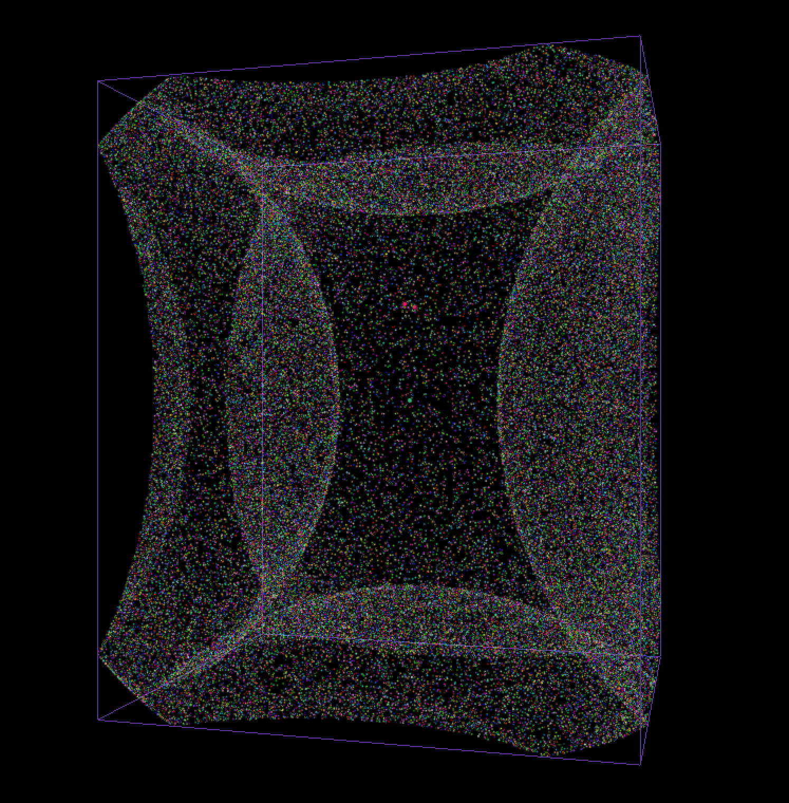

# Ray-Tracing-Impulse-Response-Generator
Synthesizes a room impulse response using a ray tracing simulation engine.

A room impulse response (RIR) is a measure of the acoustic response of a physical space to an impulse (a short burst of sound).

Typically RIRs are obtained by recording a pistol shot or balloon pop with a microphone placed inside of the room. An RIR can also be obtained by playing a sine sweep through a loudspeaker, recording the result with a microphone, and then deconvolving the resulting sound with the original sine sweep to obtain the impulse response.

This program aims to simulate the process of recording RIRs using a simple physical model. In this model, the room, sound source, and microphone location are modeled as virtual objects, and rays are sent out from the sound source and propagate throughout the virtual space until they reach the virtual microphone. The sum of the amplitudes of all such rays, combined with the time it takes for them to reach the microphone, creates the impulse response, which is output as a .WAV file.

This is a simple program that ignores phenomena such as diffraction and interference that can have a significant effect in a real acoustic space. It also does not perform filtering, though this could be achieved simply by passing the impulse response through one or several time-varying digital filters to simulate the effect of frequency-dependent absorption.

The program has two modes: one mode computes the impulse response quickly but does not provide a visual aid; the other allows the user to view the rays as they propagate throughout the virtual space, which can be interesting but takes a lot longer (as some of the rays might reflect many times before they hit the microphone).

Additional notes:

The ray tracing algorithm used in this model is stochastic, meaning that rays are randomly given initial direction vectors, and this means that it is not guaranteed, even with identical starting parameters, to produce the same exact impulse response each time it is run.

The room model is always a rectangular prism. In a future version of this program, more complicated room geometries will be included.
